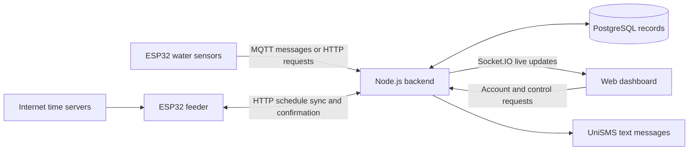

# AquaSense

AquaSense is an aquaculture monitoring project that connects ESP32 devices to a web dashboard. It records water conditions, identifies possible problems, sends SMS alerts, and manages feeding schedules.

The **frontend** is the website; the **backend** handles readings, accounts, and commands; **PostgreSQL** stores permanent records. XAMPP's Apache, PHP, and MySQL are not required.

## 1. Features and current scope

| Area | What it provides |
| --- | --- |
| Website and accounts | Home, About, Features, and How It Works pages; account registration, login, logout, and protected dashboard access. |
| Water monitoring | Temperature, pH, dissolved oxygen, turbidity, and ammonia displays, with recent readings, charts, and summary statistics. Available measurements depend on the connected sensors. |
| Early warnings | Rules and recent trends identify possible problems, with risk, confidence, and suggested actions. Ammonia may be estimated when unmeasured. Accuracy has not been statistically validated. |
| Alerts and SMS | Active/recent alerts and SMS attempt records. The API also supports acknowledging, resolving, and resending alerts. |
| Feeding | Create, edit, enable, disable, and delete schedules; request manual feeding or ON/OFF commands. Physical operation requires the configured ESP32 feeder. |
| Device management | API registration and deactivation of devices, with device ownership and keys for authenticated device requests. |
| Settings | Editable farmer, farm, tank, and location information displayed in the dashboard. |

**Current limitations:** Aerator and water-change controls are browser demonstrations without physical pump/aerator integration. Risk trend curves are illustrative, not historical predictions. Profile settings and some control history stay in the current browser. The Settings contact number does **not** change the server's SMS recipient. The contact form and password-recovery link are placeholders.

## 2. How the parts connect



MQTT carries sensor messages; HTTP handles direct requests; Socket.IO delivers live browser updates. **Online** means the browser is connected. Check reading timestamps to confirm the sensors are reporting.

## 3. Project folders

| Location | Purpose |
| --- | --- |
| `Frontend/src/pages/`, `components/` | Website/dashboard screens and reusable interface elements. |
| `Frontend/src/hooks/`, `services/`, `config/` | Data loading, server requests, live connections, and server addresses. |
| `Frontend/src/types/`, `styles/`, `assets/` | Data definitions, styling, and image assets. |
| `Backend/src/api/v1/` | Main API routes and request handlers for accounts, devices, sensors, alerts, SMS, and feeding. |
| `Backend/src/iot/water/`, `websocket/` | Water dashboard endpoints, statistics, thresholds, and live updates. |
| `Backend/src/services/` | Monitoring, predictions, MQTT, SMS, feeding, and audit-record logic. |
| `Backend/src/database/`, `Backend/migrations/` | Database connection, table definitions, compatibility updates, and SQL changes. |
| `Backend/src/config/`, `middleware/`, `types/`, `utils/` | Settings, access checks, validation, data definitions, and logging. `src/routes/` and `src/controllers/` contain older examples. |
| `ESP32_Water_Quality_MQTT/` | Arduino water-sensor sketch. A different sketch with the same name also exists at the project root. |
| `ESP32_Feeding_System_NTP.ino` | Feeder firmware with internet time synchronization and servo control. |
| `docs/`, `scripts/` | Database diagrams, security scanning, and a Git secret-history cleanup utility. |
| Root helpers and reports | `START_ALL.bat`, `COMMANDS.sh`, and the security, SMS, and prediction evaluation documents. |

Each application has a `package.json` library/command list and `.env.example` settings template. `node_modules/` holds installed libraries; `dist/` holds builds. Hidden `.vscode/`, `.agents/`, and `.github/` folders support development.

## 4. Technologies and libraries

| Purpose | Libraries / technologies |
| --- | --- |
| Website | React 18, React DOM, TypeScript, React Router 7, Tailwind CSS 3, Recharts 3. |
| Server | Node.js, Express 4, TypeScript. |
| Communication | Axios, MQTT.js (`mqtt`), Socket.IO and `socket.io-client`. |
| Database | PostgreSQL, Sequelize 6, `pg`, and `pg-hstore`. `sqlite3` and `better-sqlite3` are listed dependencies, but the current startup/schema code requires PostgreSQL. |
| Security and validation | `bcryptjs` for password hashing; `jsonwebtoken` for sessions; Helmet, CORS, `express-rate-limit`, and Zod. |
| Utilities | `dotenv` for configuration, Morgan for request logs, and `uuid` for identifiers. |
| Build and development | Vite 8, its React plugin, PostCSS, Autoprefixer, Terser, nodemon, ts-node, ESLint, Prettier, and TypeScript type packages. |
| ESP32 | Arduino C++, ESP32 board support, WiFi, HTTPClient, time, PubSubClient, OneWire, DallasTemperature, ArduinoJson, and ESP32Servo, depending on the sketch. |

Full dependency declarations: [frontend package.json](Frontend/package.json) and [backend package.json](Backend/package.json).

## 5. Local setup

Install **Node.js 22.x, version 22.12 or later**, npm, and PostgreSQL with pgAdmin. Hardware setup also needs Arduino IDE with ESP32 support.

**Step 1 — Install libraries.** Run from the project root in PowerShell. Existing `.env` files are preserved:

```powershell
npm.cmd --prefix Backend ci
npm.cmd --prefix Frontend ci
if (!(Test-Path Backend/.env)) { Copy-Item Backend/.env.example Backend/.env }
if (!(Test-Path Frontend/.env)) { Copy-Item Frontend/.env.example Frontend/.env }
```

`npm ci` installs the versions recorded in the included lockfiles.

**Step 2 — Configure the backend.** Edit `Backend/.env`:

| Setting | What to enter |
| --- | --- |
| `DB_HOST`, `DB_PORT`, `DB_NAME`, `DB_USER`, `DB_PASSWORD` | PostgreSQL details: `localhost`, `5432`, `AquaSense`, `postgres`, and your password. Keep `DB_DIALECT=postgres`. |
| `PORT`, `HOST`, `CORS_ORIGIN` | Local defaults: `5001`, `localhost`, and the allowed website `http://localhost:3000`. |
| `JWT_SECRET` | A private random value of at least 32 characters. Replace the template value. |
| `UNISMS_API_SECRET_KEY`, `UNISMS_SENDER_ID`, `FARMER_PHONE` | Valid provider key, assigned/approved sender ID, and real farmer mobile. A placeholder key permits startup but cannot send. Leave the phone blank to skip automatic SMS. |
| `MQTT_*`, `DEVICE_KEYS` | Sensor messaging settings and device credentials; see integration instructions below. |

Generate `JWT_SECRET` with `node -e "console.log(require('crypto').randomBytes(48).toString('hex'))"`. Keep secrets out of Git and screenshots. Backend `.env` overrides matching process environment settings.

**Step 3 — Prepare PostgreSQL.** In pgAdmin, create a database named exactly `AquaSense`. For an existing installation, restore its backup instead of starting with an empty database.

Startup currently updates tables before creating them. A new database needs this one-time preparation:

<details>
<summary>One-time table creation for a new, empty database</summary>

Run from the project root after checking `Backend/.env`. This creates the nine tables without starting the server or integrations. Use only for a new, empty database.

```powershell
cd Backend
@'
require('dotenv').config({ override: true });
const db = require('./src/database/connection');
const models = require('./src/database/models');
(async () => {
  await db.initializeDatabase();
  Object.keys(models)
    .filter(name => name.startsWith('initialize') && name.endsWith('Model'))
    .forEach(name => models[name]());
  await db.syncDatabase();
})().catch(error => {
  console.error(error.message);
  process.exitCode = 1;
}).finally(() => db.closeDatabase());
'@ | node -r ts-node/register
cd ..
```

</details>

**Step 4 — Start both applications.** Open two terminals at the project root:

```powershell
# Terminal 1
npm.cmd --prefix Backend run dev
```

```powershell
# Terminal 2
npm.cmd --prefix Frontend run dev
```

Open **http://localhost:3000** and create an account. **http://localhost:5001/health** checks whether the backend responds. `START_ALL.bat` is a Windows shortcut after setup. Stop each server with `Ctrl+C`.

Run only one backend instance. `npm run dev` checks the configured port before starting: if a healthy AquaSense backend already uses it, the command reports that and exits normally. To restart, stop the existing backend in its own terminal with `Ctrl+C`, then run the command again. An occupied port without a verified healthy backend produces a diagnostic instead. Run `npm.cmd --prefix Backend run test:startup` to check this startup guard.

`Frontend/.env`: `VITE_API_URL=http://localhost:5001/api/v1` and `VITE_WS_URL=http://localhost:5001`. Restart after changes. Older guides mention 5000; the supplied templates use **5001**.

## 6. Integration setup

**Water sensors through MQTT.** Configure Wi-Fi and match the sketch's broker/topics with backend `MQTT_*` settings. Template topics are `water/esp32/readings` and `aquasense/+`; broker credentials use `MQTT_USERNAME` and `MQTT_PASSWORD`.

- The folder sketch sends temperature, pH, and raw turbidity separately. Missing oxygen is tagged as unmeasured (`do_measured=false`), excluded from oxygen alerts/predictions, and hidden in dashboard oxygen values/charts. `MQTT_DEFAULT_DO` is no longer used. Historical rows lack measurement provenance and are also marked unmeasured. Calibrate raw turbidity to NTU and the pH sensor before relying on their alerts; ammonia is unmeasured.
- The root sketch uses `capstone2026/water/esp32/readings`. Match that topic and replace its `millis()` timestamp with real date/time, or omit it to use backend receipt time.
- The sketches use different pins. Follow the selected sketch's definitions and calibrate sensors; raw turbidity is not a calibrated NTU measurement.

**Direct sensor requests.** `POST /api/v1/sensors/data` accepts `deviceId`, `temperature`, `ph`, `dissolvedOxygen`, `turbidity`, and optional `ammonia`. `/api/v1/water/readings` uses `do` instead of `dissolvedOxygen`. Configure comma-separated `device-id:private-key` entries in `DEVICE_KEYS`; send the matching `X-Device-Key` header.

**Feeder and internet time.** A maintainer registers the feeder through authenticated `POST /api/v1/devices` using `deviceId` and `name`; no registration screen exists. Match firmware `DEVICE_KEY` with `DEVICE_KEYS`. Browser API writes require the login cookie and `X-CSRF-Token`.

Match firmware `DEVICE_ID` and backend `FEEDER_DEVICE_ID` (default `esp32-feeder-1`). Set firmware `API_BASE_URL` to the backend computer's network address, port **5001**. Local-network access requires backend `HOST=0.0.0.0` and a firewall allowance. The powered ESP32 runs up to 20 schedules, polls `/feeding/device/sync` every 30 seconds, and confirms through `/feeding/device/ack`. It uses servo GPIO 13 and UTC+8 time; backend `FEEDING_TIMEZONE` defaults to `Asia/Manila`. Manual commands may wait for the next poll.

**SMS through UniSMS.** Set a valid API key and international `FARMER_PHONE` (`+63` plus the mobile number without its initial `0`). Configure `FARMER_NAME`, `TANK_NAME`, and optional `FARM_NAME`. Set `UNISMS_SENDER_ID` to the exact sender assigned/approved by UniSMS. Critical/emergency alerts and eligible high/critical predictions trigger texts. Every submission is reserved in `sms_logs` before sending, with database locking to prevent duplicates. Pending messages are checked by reference ID every 30 seconds; only provider-confirmed sent messages are labeled Sent. Validation failures are not automatically retried within a submission; automatic alerts back off for at least one minute after a failed attempt. Timeouts with uncertain submission status are labeled Unconfirmed and blocked from automatic resending until reviewed against provider history. This is provider send status, not a handset delivery receipt.

**Access boundaries.** HTTP has session, role, and device checks, with development exceptions. MQTT and Socket.IO lack equivalent authentication; water records are shared across accounts. Public or separate-farm deployment needs these gaps addressed and a private, authenticated broker.

## 7. Database, backups, and recovery

**What is stored:**

| Tables | Records |
| --- | --- |
| `users`, `devices` | Accounts, hashed passwords, registered devices, and ownership. |
| `sensor_readings` | Time-stamped water measurements. |
| `alerts`, `sms_logs` | Warnings, their status, and SMS attempts. |
| `feeding_schedules`, `feeding_commands` | Schedules and command/confirmation records. |
| `prediction_logs`, `audit_logs` | Recorded predictions and selected user/device actions. |

The [database models](Backend/src/database/models) define the tables. Startup includes fixes for ammonia, roles, feeding dates/ownership, and prediction/audit tables. Its `sync({ alter: false })` setting does not repair every old schema. The [alert/SMS migration](Backend/migrations/20260512_alert_sms.sql) is manual; no automatic migration runner exists.

**Back up daily and before changes.** No backup job is included. In pgAdmin: right-click `AquaSense` → **Backup** → **Custom**, then save a dated file outside the project. PowerShell equivalent, with PostgreSQL's `bin` folder on PATH and connection details matching `.env`:

```powershell
New-Item -ItemType Directory -Force -Path C:\AquaSenseBackups
$backupFile = "C:\AquaSenseBackups\AquaSense-$(Get-Date -Format yyyyMMdd-HHmmss).dump"
pg_dump -h localhost -p 5432 -U postgres -d AquaSense -Fc -f $backupFile
```

Confirm success and a nonempty file. Keep a second protected copy elsewhere; a starting policy is seven daily and four weekly copies, tested monthly. Separately protect `.env`, firmware settings, and matching source code. A project-folder copy does not back up PostgreSQL. Browser settings/history and API threshold edits are excluded; threshold edits also reset on backend restart.

**Restore without overwriting the original database:**

1. Stop the backend and pause device connections. Preserve the existing database and take a backup if possible.
2. Create a separate empty database, such as `AquaSense_restore`, in pgAdmin. Right-click it, choose **Restore**, and select the saved Custom backup. Command-line equivalent:

   ```powershell
   createdb -h localhost -p 5432 -U postgres AquaSense_restore
   pg_restore -h localhost -p 5432 -U postgres -d AquaSense_restore --no-owner --single-transaction --exit-on-error "C:\AquaSenseBackups\YOUR-BACKUP.dump"
   ```

3. Stop if restoration reports errors. After success, check tables, accounts, reading dates, and schedules. Set `DB_NAME=AquaSense_restore` in backend `.env` and restart with hardware and SMS paused.
4. Verify login/history and review restored pending feeding commands before reconnecting devices and SMS. Keep the original database until recovery is confirmed. Later readings are absent unless recovered from another source.

Never fix database errors by deleting tables or enabling `sync({ force: true })`; that can erase records. Test schema changes and migrations against a restored copy first.

## 8. Common problems and maintenance

| Problem | First action |
| --- | --- |
| Database connection refused / login failed | Start the PostgreSQL Windows service; verify host, port, database name, and password in `Backend/.env`. |
| `relation does not exist` on a new setup | Complete the one-time table creation above. For an existing installation, verify the database selection and restore missing data rather than creating an empty replacement. |
| Missing column after an update | Back up, compare the table with its model, and have a maintainer apply the relevant migration on a test copy first. |
| Backend will not start / port already used | Read the first terminal error. Check required configuration, then stop duplicate servers or update both applications' port settings. |
| Login fails or requests show 401/403 | Sign in again; keep hostname, CORS, and cookie settings consistent. For devices, verify registration, ownership, active status, and key. |
| Dashboard connects but readings are stale | Check ESP32 power/Wi-Fi, broker/topic agreement, sensor timestamps, and calibration. A 1970-era date can indicate the root sketch's `millis()` timestamp issue. |
| No SMS / feeder does not respond | Check SMS credentials, phone, provider response, and cooldowns; for feeding, check device ownership, API address, internet time, and the 30-second polling delay. |

**Routine care:** Check fresh readings and failed alerts daily; review disk space, PostgreSQL health, and backups weekly. Keep PostgreSQL automatic cleanup enabled. No scheduled history deletion is configured. Agree on retention and back up before removing old records.

Test updates separately. In **each** application folder, run `npm run type-check`, `npm run lint`, and `npm run build`. Backend `npm run test:sms` mocks provider requests. Root command `node scripts/security-check.mjs` checks tracked files for common secret/configuration mistakes. Verify hardware and restores separately.

For hosting, run `npm start` in the built backend and serve `Frontend/dist/` through a web host. Set `NODE_ENV=production`, `AUTH_COOKIE_SECURE=true`, and `CORS_ORIGIN` to the real website. Use HTTPS, private credentials, backups, and the access fixes above. Rebuild after frontend environment changes. The Git history cleanup script rewrites history; it is not a backup tool.

## 9. Further documentation

- [Implemented database diagram](docs/ERD.md) — compare with current models; [extended ERD](docs/ERD_final.md) also contains proposed tables that are not implemented.
- [Backend API structure](Backend/API_STRUCTURE.md) — development organization and examples; current routes are in `Backend/src/api/v1/routes/` and `Backend/src/iot/water/routes.ts`.
