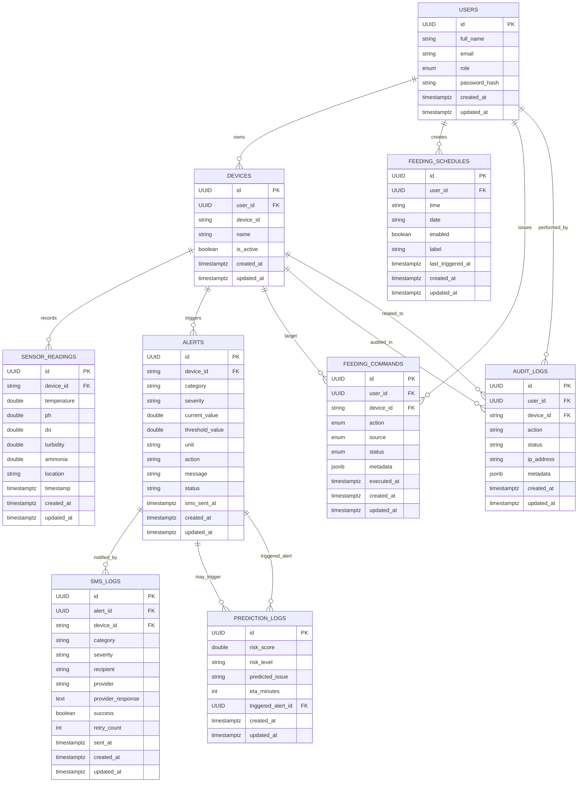

# AquaSense - Implemented Database ERD

This file contains a Mermaid ER diagram that represents the final implemented schema (based on the Sequelize models and migrations in `Backend/src/database/models`).



Notes:

- This ERD describes the schema implemented in `Backend/src/database/models` and the migration in `Backend/migrations/20260512_alert_sms.sql`.
- The original diagram you provided (tanks, sensors, sensor_types, relays, solar_system, etc.) is not present in code; instead the implementation uses `devices` and embeds multiple sensor metrics in `sensor_readings`.

Rendering:

- You can preview this Mermaid diagram in VS Code with the "Markdown Preview Mermaid Support" or the "Mermaid Preview" extension, or use the `mmdc` CLI to export to PNG/SVG.

Example `mmdc` command to export to PNG:

```bash
# install mermaid-cli globally if needed
npm install -g @mermaid-js/mermaid-cli
# render
mmdc -i docs/ERD.md -o docs/ERD.png
```
